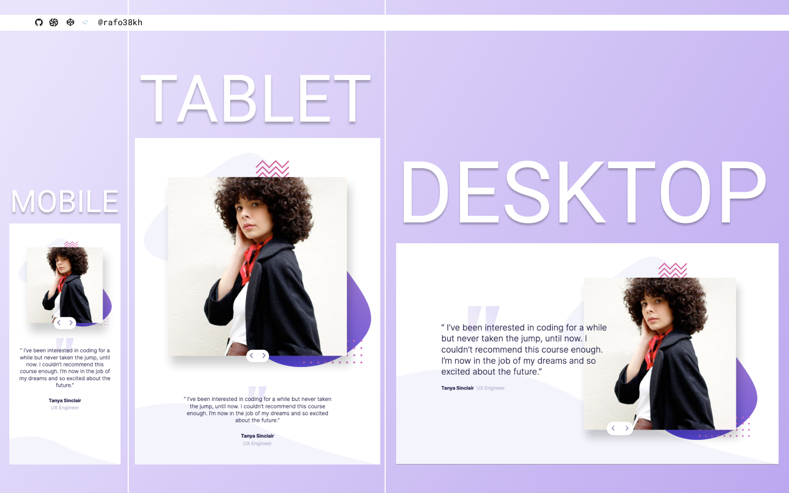

# Frontend Mentor - Coding Bootcamp Testimonials Slider Solution

This is a solution to the [Coding Bootcamp Testimonials Slider Challenge on Frontend Mentor](https://www.frontendmentor.io/challenges/coding-bootcamp-testimonials-slider-4FNyLA8JL)

## Table of contents

- [Overview](#overview)
  - [The challenge](#the-challenge)
  - [Screenshot](#screenshot)
  - [Links](#links)
- [My process](#my-process)
  - [Built with](#built-with)
- [Author](#author)

## Overview

### The challenge

- View the optimal layout for the component depending on their device's screen size
- Navigate the slider using either their mouse/trackpad or keyboard

### Screenshot

### Links

- Solution URL: 
- Live Site URL: 

## My process

### Built with

- Semantic HTML5 markup
- SCSS custom properties
- CSS Flexbox
- Mobile-first workflow

## Author

- Frontend Mentor - [@rafo38kh](https://www.frontendmentor.io/profile/rafo38kh)
- GitHub - [@rafo38kh](https://github.com/rafo38kh)
- Codewars - [@rafo38kh](https://www.codewars.com/users/rafo38kh)
